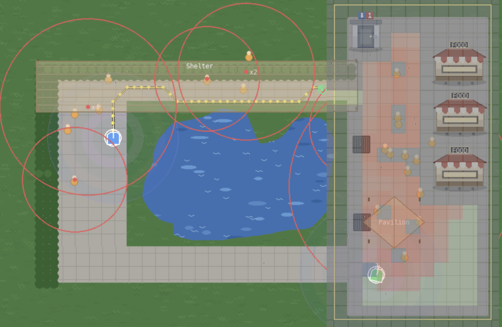

# Ecological Computation - Human-Aware Navigation & Coverage for a Mosquito-Control Robot

[](LICENSE)
[](https://www.python.org/)
[](#)



> Reference implementation of two published planners for a mosquito-control
> robot - a point-to-point planner that routes around crowds of people while
> approaching mosquito hotspots, and a complete-coverage planner that services
> crowded regions first. Unified pygame demo.

New to human-aware robot planning? Run `python demo.py` - an interactive
park sandbox: drop bushes, trees, ponds, shelters, pavilions, buildings,
pavement, drains, eateries, toilets and people from the palette, spawn up to
five differential-drive robots, drive them with WASD, and dispatch them on a
PP\* point-to-point plan (left-click) or an HFA-CCPP area-coverage plan
(left-drag a rectangle).

---

## Algorithms

| Module | Contribution | Headline | Venue |
|---|---|---|---|
| [`ppstar/`](ppstar) - `open_ppstar.py` | Predator-dominance and prey-approach A\* - *PP\** | Reaches the mosquito hotspot with zero crowd exposure where plain A\*/Dijkstra cut through people; the predator is a proximity cluster of people whose dominance scales with the crowd size | [Springer ICSR+AI 2025](https://doi.org/10.1007/978-981-95-2379-5_19) |
| [`hfaccpp/`](hfaccpp) - `open_hfaccpp.py` | Human-first complete coverage on stacked GBNNs - *HFA-CCPP* | Full coverage with human-dense areas serviced ~40-55% earlier, via the summed coverage (ν) + social (μ) neural layers | [Scientific Reports 2025](https://doi.org/10.1038/s41598-025-16114-1) |

Click a module name for its README - each has the full paper citation (BibTeX),
DOI link, theory pointers, and a standalone run command.

---

## Disclaimer - Simplified simulation

This codebase is a simplified simulation adaptation of the original work
performed at SUTD on a physical mosquito pest-control robot platform.
It is intended as a reference implementation of the *algorithms*; some aspects
of the deployed system are abstracted, simplified, or omitted entirely. In
particular, the simulation may not fully represent:

- **Navigation stack** - the deployed system runs a substantially more complex
  navigation pipeline, with behavioural recovery, fault handling, and
  re-planning that are not reproduced here.
- **Catch-and-lure methodology** - the simulation uses a significantly
  simplified model of mosquito ethology and of the lure-and-capture process.
- **Hardware dynamics** - environmental uncertainty, sensor and actuation
  noise, and other real-world effects are not modelled.
- **Weather (work in progress)** - the time-of-day and weather controls are
  still under development. Future updates will give them a richer effect on the
  mosquito population, the environment, and the rendering.

Treat this codebase as the algorithmic core of the published work - useful for
understanding, replicating, and building on the algorithms - but not as a
faithful representation of the deployed hardware system.

---

## Prerequisites

- **Python 3.9 or newer** - check with `python3 --version`
- **pip** - bundled with modern Python
- **git** - for cloning the repository

The algorithm classes (`PPStar`, `HFACoveragePlanner`) and `common/` depend
only on the Python standard library. The interactive demo additionally
needs `pygame`.

---

## Installation

```bash
git clone https://github.com/AshWan13/ecological-computation.git
cd ecological-computation
pip install -e ".[pygame]"
```

Other install variants:

- `pip install -e .` - algorithm classes only. Use this to import the planners
  into your own project.
- `pip install -e ".[pygame]"` - adds pygame for the interactive sandbox.
- `pip install -e ".[dev]"` - adds pytest, ruff, black for development.

---

## Running the demo

From the repository root:

```bash
python demo.py            # interactive pygame sandbox
python demo.py --test     # headless sanity check; expected: "All headless tests PASSED."
```

The sandbox draws a continuous park: a textured grass field with placeable
features, people (orange) who wander, and differential-drive robots drawn as a
pentagonal body (a polygon inscribing the circular footprint) with a heading
line, an id, and a pulsing UV-lure area-of-effect. No-entry features (bush,
tree stump, pond, eatery, toilet, building) become obstacles; a tree
canopy is accessible (drive under it), shelters and pavilions are open
canopies you pass under, and pavement is the only autonomously-plannable
surface.

Iterative planning. Both planners track the *live* crowd:

- PP\* re-plans the full point-to-point path every 2 ticks on a fine
  grid (`GP_FINE = 13 px`), generating node-to-node waypoints (one per grid
  cell). The predator is a proximity cluster of people, re-clustered from
  the current human positions each replan.
- HFA-CCPP advances one coverage step each tick on a coarser Cartesian
  box grid (`GP_BOX = 26 px`), refreshing both neural layers from the live
  crowd and obstacle map.

Autonomous plans run on pavement only - a robot on grass can be teleoperated
but cannot auto-plan, and paths keep a one-cell clearance from grass edges and
obstacles.

### Importing classes into your own code

```python
from common.environment import pp_scenario, coverage_scenario, start_cell
from ppstar.open_ppstar import PPStar, ppstar_maze
from hfaccpp.open_hfaccpp import HFACoveragePlanner

# Point-to-point: reach the prey (mosquito hotspot) while avoiding the crowd.
# Predators are proximity clusters of the world's people; cluster size sets
# the crowd-size weight Cs (paper Eqn 3).
world = pp_scenario(1)
pp = PPStar(world).ppstar(world.start, world.goal)        # or .astar / .dijkstra
print(pp.length, pp.crowd_exposure, pp.expanded)

# ...or the standalone maze entry point (mirrors the reference code):
res = ppstar_maze(world.grid, world.start, world.goal, crowd=world.humans)

# Complete coverage: full coverage, human-dense areas first.
cov_world = coverage_scenario(12, 12, seed=0)
cov = HFACoveragePlanner(cov_world, human_first=True).plan(start_cell(cov_world))
print(cov.coverage_fraction, cov.steps, cov.human_weighted_delay)
```

Each algorithm module is also runnable standalone:

```bash
python -m ppstar.open_ppstar --scenario 1   # 1, 2, or 3
python -m hfaccpp.open_hfaccpp --seed 0
```

### Platform-specific notes

**macOS (Apple Silicon and Intel)** - tested on macOS 12+ with Python
3.9-3.12. The cleanest setup is a virtualenv inside the cloned repo:

```bash
cd ecological-computation
python3 -m venv .venv
source .venv/bin/activate
pip install --upgrade pip setuptools wheel
pip install -e ".[pygame]"
python demo.py --test
python demo.py
```

If pygame fails with an SDL error: `brew install sdl2 sdl2_image sdl2_ttf`
then `pip install --force-reinstall pygame`.

**Windows (10 / 11)** - tested with Python 3.9-3.12 from python.org. pygame
installs cleanly via pip wheels:

```powershell
python --version
pip install -e ".[pygame]"
python demo.py
```

If the window doesn't appear, confirm you're not in WSL without a display
server (use a native Windows Python, or run an X server such as VcXsrv).

**Linux (Ubuntu / Debian)** - install Python tooling and SDL2 libraries:

```bash
sudo apt update
sudo apt install -y python3 python3-pip python3-venv python-is-python3 \
                    libsdl2-dev libsdl2-image-dev libsdl2-ttf-dev
cd ecological-computation
python3 -m venv .venv
source .venv/bin/activate
pip install --upgrade pip setuptools wheel
pip install -e ".[pygame]"
python demo.py --test     # headless; no display needed
python demo.py
```

Over SSH or in a container, enable X11 forwarding (`ssh -X user@host`) or use a
virtual display (`xvfb-run python demo.py`).

### Quick sanity check

```bash
python -c "from ppstar.open_ppstar import PPStar; print('OK')"
```

---

## Using the demo

| Input | Action |
| --- | --- |
| `1` … `5` | spawn-or-select the robot with that id (up to five) |
| `W` / `S` | drive the selected robot forward / backward (half speed on grass) |
| `A` / `D` | rotate counter-clockwise / clockwise (differential drive) |
| `Q` / `E` | increase / decrease the speed scale |
| `P` | cycle the point-to-point planner: PP\* → A\* → Dijkstra |
| `H` | toggle human-first coverage (HFA-CCPP vs base GBNN) |
| `SHIFT` (hold) | overlay the planner layers - PP\*: predator cluster circles (labelled `×N`), prey goal, and the planned path; HFA-CCPP: the summed neural field (obstacle / covered / uncovered / risk-influenced) and the swept trace |
| left-click (empty) | dispatch the selected robot point-to-point (PP\*) there |
| left-drag (empty) | select a rectangle → HFA-CCPP coverage of that area |
| right palette | pick a feature, then click (fixed size) or click-drag (sized) |
| left-drag a feature | move that feature to a new position |
| double-click a feature | despawn it (works even with a feature tool selected) |
| `SPACE` | stop the selected robot |
| `X` | cancel the selected robot's plan |
| `C` | clear all features |
| `R` | reset the scenario |
| `Esc` | quit |

The palette (right) places Human, Bush, Tree, Shelter, Pavilion, Building,
Pavement, Drain, Pond, Eatery, Toilet. Bush, Pavilion, Building and Pavement
are sized by click-drag; the rest (including the standalone Shelter canopy) drop
at a fixed size. Pressing on an already-placed feature acts on that feature -
drag it to move it, or double-click it to remove it - so a press over a feature
never spawns a new one on top. The path plan and predator circles are shown
only while SHIFT is held. Each robot keeps its own plan, so you can dispatch
several at once and drive one manually while the others run.

---

## Reproducing the headline claims

PP\* (point-to-point). On each shipped maze, PP\* reaches the prey with
zero crowd exposure where plain A\* and Dijkstra route through the crowd, at
a modest extra path length:

```bash
python -m ppstar.open_ppstar --scenario 1   # 1, 2, or 3
```

HFA-CCPP (coverage). Both base GBNN and HFA-CCPP reach 100% coverage;
HFA-CCPP reports a ~40-55% lower human-weighted coverage delay (crowded cells
visited earlier):

```bash
python -m hfaccpp.open_hfaccpp --seed 0
```

The headless self-test asserts both properties across several seeds:

```bash
python demo.py --test
```

---

## Troubleshooting

- **`ModuleNotFoundError: No module named 'common'`** - run from the repository
  root after `pip install -e .`. The `python` you invoke must be the same
  interpreter where you ran pip.
- **pygame window won't open / `No available video device` on Linux** - install
  `libsdl2-dev`, then run from a desktop session, use `xvfb-run python demo.py`,
  or enable X11 forwarding over SSH.
- **`pip install -e .` fails on Apple Silicon** - update pip first
  (`pip install -U pip setuptools wheel`), then re-run.

---

## Citation

Machine-readable metadata is in [`CITATION.cff`](CITATION.cff). To cite a
specific algorithm, use the BibTeX block from that module's README
([`ppstar`](ppstar/README.md), [`hfaccpp`](hfaccpp/README.md)).

---

## Repository layout

```
ecological-computation/
├── README.md                ← you are here
├── LICENSE                  BSD 3-Clause
├── CITATION.cff
├── pyproject.toml
├── requirements.txt
├── .gitignore
│
├── assets/                  README images (hero.png)
├── demo.py                  continuous park sandbox + headless --test
│
├── common/                  shared utilities (no contributions)
│   ├── __init__.py
│   ├── environment.py           grid world + maze / coverage scenario library
│   ├── features.py              park feature palette + occupancy rasteriser
│   ├── robot.py                 differential-drive robot (teleop + path follow)
│   └── replicated_gbnn.py       base GBNN (Glasius et al. 1995) - prior art
│
├── ppstar/               PP* point-to-point planner (ICSR+AI 2025)
│   ├── __init__.py
│   ├── open_ppstar.py         PP* (proximity-cluster predators) + A* + Dijkstra
│   └── README.md            paper details + BibTeX + DOI
│
└── hfaccpp/                 HFA-CCPP complete coverage (Sci. Rep. 2025)
    ├── __init__.py
    ├── open_hfaccpp.py           summed coverage (ν) + social (μ) GBNN layers
    └── README.md
```

---

## Acknowledgements

This work has been adapted into a simplified simulation. The original work was
carried out at the [Singapore University of Technology and Design](https://www.sutd.edu.sg/)
under the supervision of **Prof. Mohan Rajesh Elara**.

This research was supported by A\*STAR under the RIE2025 IAF-PP programme,
*Modular Reconfigurable Mobile Robots (MR)²* (Grant No. **M24N2a0039**), and by
the National Robotics Programme. Per-paper funding details are in each module's
README and the source papers.

The codebase builds on:

- The Glasius Bio-inspired Neural Network (Glasius, Komoda & Gielen, 1995),
  re-implemented as the coverage base in [`common/replicated_gbnn.py`](common/replicated_gbnn.py).
- The classical A\* shortest-path algorithm (Hart, Nilsson & Raphael, 1968),
  used as the search base for PP\*.

---

## Contact

Dr. Ash Wan Yaw Sang - <yaw_sang94@hotmail.com> · [LinkedIn](https://www.linkedin.com/in/ashwanyawsang/)
